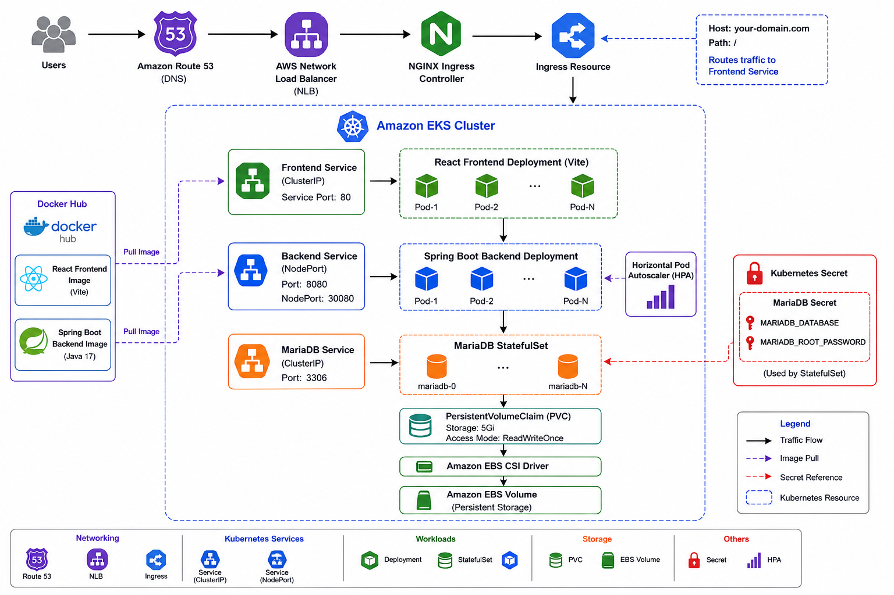

# Architecture

## Overview

This project demonstrates the deployment of a **three-tier Student Management Application** on **Amazon EKS** using Kubernetes. The application follows a three-tier architecture consisting of a React frontend, a Spring Boot backend, and a MariaDB database.

The frontend is exposed through an NGINX Ingress Controller, while the backend and database communicate internally using Kubernetes Services. Persistent database storage is provided by Amazon EBS through the Amazon EBS CSI Driver.

---

## Technology Stack

| Layer              | Technology                      |
| ------------------ | ------------------------------- |
| Frontend           | React (Vite, npm, node)         |
| Backend            | Spring Boot (Java,Maven)        |
| Database           | MariaDB                         |
| Containerization   | Docker                          |
| Container Registry | Docker Hub                      |
| Orchestration      | Kubernetes (Amazon EKS)         |
| Ingress            | NGINX Ingress Controller        |
| DNS                | Amazon Route 53                 |
| Persistent Storage | Amazon EBS                      |
| Auto Scaling       | Horizontal Pod Autoscaler (HPA) |

---

## Architecture Diagram

<p align="center">
  
</p>
```

---

## Kubernetes Resources

| Resource                        | Purpose                                              |
| ------------------------------- | ---------------------------------------------------- |
| Deployment                      | Manages the frontend and backend pods                |
| StatefulSet                     | Deploys the MariaDB database with stable storage     |
| Service                         | Enables communication between application components |
| Ingress                         | Exposes the frontend to external users               |
| Secret                          | Stores the database name and password                |
| PersistentVolumeClaim (PVC)     | Requests persistent storage for MariaDB              |
| StorageClass                    | Dynamically provisions Amazon EBS volumes            |
| Horizontal Pod Autoscaler (HPA) | Automatically scales backend pods based on CPU usage |

---

## Key Features

* Three-tier application architecture
* Dockerized React and Spring Boot applications
* Kubernetes Deployments and StatefulSets
* MariaDB persistent storage using Amazon EBS
* Dynamic volume provisioning with the Amazon EBS CSI Driver
* Horizontal Pod Autoscaler (HPA) for backend scaling
* NGINX Ingress Controller for external access
* Amazon Route 53 for DNS management
* Secure database configuration using Kubernetes Secrets
